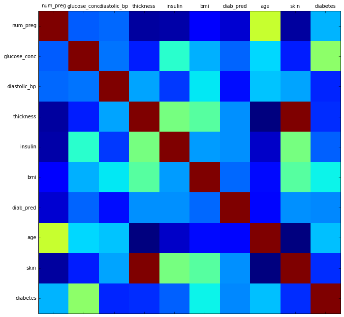
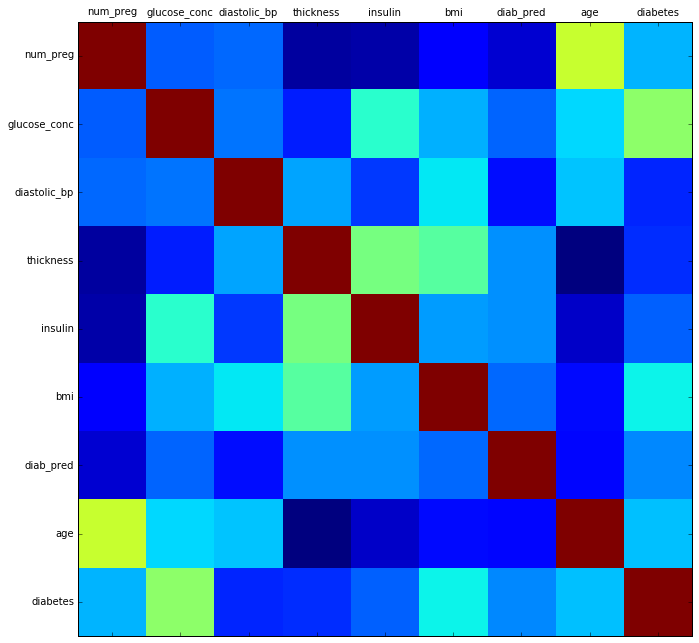
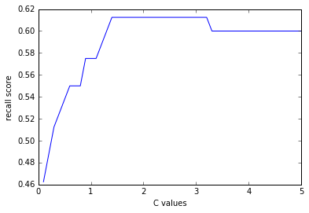
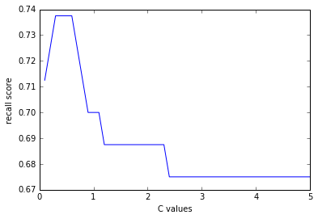

# Machine Learning
Helping to predict diabetes.

## Import libraries


```python
import pandas as pd # dataframe library
import matplotlib.pyplot as plt # plots data
import numpy as np # N-dim object support

# separate window
%matplotlib inline 
```

## Load and review data


```python
df = pd.read_csv("./data/data.csv")
df.shape
```


    (768, 10)


```python
df.head(5)
```


<div>
<table border="1" class="dataframe">
  <thead>
    <tr style="text-align: right;">
      <th></th>
      <th>num_preg</th>
      <th>glucose_conc</th>
      <th>diastolic_bp</th>
      <th>thickness</th>
      <th>insulin</th>
      <th>bmi</th>
      <th>diab_pred</th>
      <th>age</th>
      <th>skin</th>
      <th>diabetes</th>
    </tr>
  </thead>
  <tbody>
    <tr>
      <th>0</th>
      <td>6</td>
      <td>148</td>
      <td>72</td>
      <td>35</td>
      <td>0</td>
      <td>33.6</td>
      <td>0.627</td>
      <td>50</td>
      <td>1.3790</td>
      <td>True</td>
    </tr>
    <tr>
      <th>1</th>
      <td>1</td>
      <td>85</td>
      <td>66</td>
      <td>29</td>
      <td>0</td>
      <td>26.6</td>
      <td>0.351</td>
      <td>31</td>
      <td>1.1426</td>
      <td>False</td>
    </tr>
    <tr>
      <th>2</th>
      <td>8</td>
      <td>183</td>
      <td>64</td>
      <td>0</td>
      <td>0</td>
      <td>23.3</td>
      <td>0.672</td>
      <td>32</td>
      <td>0.0000</td>
      <td>True</td>
    </tr>
    <tr>
      <th>3</th>
      <td>1</td>
      <td>89</td>
      <td>66</td>
      <td>23</td>
      <td>94</td>
      <td>28.1</td>
      <td>0.167</td>
      <td>21</td>
      <td>0.9062</td>
      <td>False</td>
    </tr>
    <tr>
      <th>4</th>
      <td>0</td>
      <td>137</td>
      <td>40</td>
      <td>35</td>
      <td>168</td>
      <td>43.1</td>
      <td>2.288</td>
      <td>33</td>
      <td>1.3790</td>
      <td>True</td>
    </tr>
  </tbody>
</table>
</div>


```python
df.tail(5)
```


<div>
<table border="1" class="dataframe">
  <thead>
    <tr style="text-align: right;">
      <th></th>
      <th>num_preg</th>
      <th>glucose_conc</th>
      <th>diastolic_bp</th>
      <th>thickness</th>
      <th>insulin</th>
      <th>bmi</th>
      <th>diab_pred</th>
      <th>age</th>
      <th>skin</th>
      <th>diabetes</th>
    </tr>
  </thead>
  <tbody>
    <tr>
      <th>763</th>
      <td>10</td>
      <td>101</td>
      <td>76</td>
      <td>48</td>
      <td>180</td>
      <td>32.9</td>
      <td>0.171</td>
      <td>63</td>
      <td>1.8912</td>
      <td>False</td>
    </tr>
    <tr>
      <th>764</th>
      <td>2</td>
      <td>122</td>
      <td>70</td>
      <td>27</td>
      <td>0</td>
      <td>36.8</td>
      <td>0.340</td>
      <td>27</td>
      <td>1.0638</td>
      <td>False</td>
    </tr>
    <tr>
      <th>765</th>
      <td>5</td>
      <td>121</td>
      <td>72</td>
      <td>23</td>
      <td>112</td>
      <td>26.2</td>
      <td>0.245</td>
      <td>30</td>
      <td>0.9062</td>
      <td>False</td>
    </tr>
    <tr>
      <th>766</th>
      <td>1</td>
      <td>126</td>
      <td>60</td>
      <td>0</td>
      <td>0</td>
      <td>30.1</td>
      <td>0.349</td>
      <td>47</td>
      <td>0.0000</td>
      <td>True</td>
    </tr>
    <tr>
      <th>767</th>
      <td>1</td>
      <td>93</td>
      <td>70</td>
      <td>31</td>
      <td>0</td>
      <td>30.4</td>
      <td>0.315</td>
      <td>23</td>
      <td>1.2214</td>
      <td>False</td>
    </tr>
  </tbody>
</table>
</div>


## Check for null values


```python
df.isnull().values.any()
```


    False


```python
# Graphical correlation matrix for each pair of columns in the dataframe
# df: pandas DataFrame
# size: vertical and horizontal size of the plot
# returns: matrix of correlation between columns
def plot_corr(df, size=11):
    corr = df.corr()
    fig, ax = plt.subplots(figsize=(size, size))
    ax.matshow(corr)
    plt.xticks(range(len(corr.columns)), corr.columns)
    plt.yticks(range(len(corr.columns)), corr.columns)
```


```python
plot_corr(df)
```





```python
df.corr()
```


<div>
<table border="1" class="dataframe">
  <thead>
    <tr style="text-align: right;">
      <th></th>
      <th>num_preg</th>
      <th>glucose_conc</th>
      <th>diastolic_bp</th>
      <th>thickness</th>
      <th>insulin</th>
      <th>bmi</th>
      <th>diab_pred</th>
      <th>age</th>
      <th>skin</th>
      <th>diabetes</th>
    </tr>
  </thead>
  <tbody>
    <tr>
      <th>num_preg</th>
      <td>1.000000</td>
      <td>0.129459</td>
      <td>0.141282</td>
      <td>-0.081672</td>
      <td>-0.073535</td>
      <td>0.017683</td>
      <td>-0.033523</td>
      <td>0.544341</td>
      <td>-0.081672</td>
      <td>0.221898</td>
    </tr>
    <tr>
      <th>glucose_conc</th>
      <td>0.129459</td>
      <td>1.000000</td>
      <td>0.152590</td>
      <td>0.057328</td>
      <td>0.331357</td>
      <td>0.221071</td>
      <td>0.137337</td>
      <td>0.263514</td>
      <td>0.057328</td>
      <td>0.466581</td>
    </tr>
    <tr>
      <th>diastolic_bp</th>
      <td>0.141282</td>
      <td>0.152590</td>
      <td>1.000000</td>
      <td>0.207371</td>
      <td>0.088933</td>
      <td>0.281805</td>
      <td>0.041265</td>
      <td>0.239528</td>
      <td>0.207371</td>
      <td>0.065068</td>
    </tr>
    <tr>
      <th>thickness</th>
      <td>-0.081672</td>
      <td>0.057328</td>
      <td>0.207371</td>
      <td>1.000000</td>
      <td>0.436783</td>
      <td>0.392573</td>
      <td>0.183928</td>
      <td>-0.113970</td>
      <td>1.000000</td>
      <td>0.074752</td>
    </tr>
    <tr>
      <th>insulin</th>
      <td>-0.073535</td>
      <td>0.331357</td>
      <td>0.088933</td>
      <td>0.436783</td>
      <td>1.000000</td>
      <td>0.197859</td>
      <td>0.185071</td>
      <td>-0.042163</td>
      <td>0.436783</td>
      <td>0.130548</td>
    </tr>
    <tr>
      <th>bmi</th>
      <td>0.017683</td>
      <td>0.221071</td>
      <td>0.281805</td>
      <td>0.392573</td>
      <td>0.197859</td>
      <td>1.000000</td>
      <td>0.140647</td>
      <td>0.036242</td>
      <td>0.392573</td>
      <td>0.292695</td>
    </tr>
    <tr>
      <th>diab_pred</th>
      <td>-0.033523</td>
      <td>0.137337</td>
      <td>0.041265</td>
      <td>0.183928</td>
      <td>0.185071</td>
      <td>0.140647</td>
      <td>1.000000</td>
      <td>0.033561</td>
      <td>0.183928</td>
      <td>0.173844</td>
    </tr>
    <tr>
      <th>age</th>
      <td>0.544341</td>
      <td>0.263514</td>
      <td>0.239528</td>
      <td>-0.113970</td>
      <td>-0.042163</td>
      <td>0.036242</td>
      <td>0.033561</td>
      <td>1.000000</td>
      <td>-0.113970</td>
      <td>0.238356</td>
    </tr>
    <tr>
      <th>skin</th>
      <td>-0.081672</td>
      <td>0.057328</td>
      <td>0.207371</td>
      <td>1.000000</td>
      <td>0.436783</td>
      <td>0.392573</td>
      <td>0.183928</td>
      <td>-0.113970</td>
      <td>1.000000</td>
      <td>0.074752</td>
    </tr>
    <tr>
      <th>diabetes</th>
      <td>0.221898</td>
      <td>0.466581</td>
      <td>0.065068</td>
      <td>0.074752</td>
      <td>0.130548</td>
      <td>0.292695</td>
      <td>0.173844</td>
      <td>0.238356</td>
      <td>0.074752</td>
      <td>1.000000</td>
    </tr>
  </tbody>
</table>
</div>


```python
# Skin is 1.0 correlated to thickness, so one of them is unnecessary data
del df['skin']
```


```python
df.head()
```


<div>
<table border="1" class="dataframe">
  <thead>
    <tr style="text-align: right;">
      <th></th>
      <th>num_preg</th>
      <th>glucose_conc</th>
      <th>diastolic_bp</th>
      <th>thickness</th>
      <th>insulin</th>
      <th>bmi</th>
      <th>diab_pred</th>
      <th>age</th>
      <th>diabetes</th>
    </tr>
  </thead>
  <tbody>
    <tr>
      <th>0</th>
      <td>6</td>
      <td>148</td>
      <td>72</td>
      <td>35</td>
      <td>0</td>
      <td>33.6</td>
      <td>0.627</td>
      <td>50</td>
      <td>True</td>
    </tr>
    <tr>
      <th>1</th>
      <td>1</td>
      <td>85</td>
      <td>66</td>
      <td>29</td>
      <td>0</td>
      <td>26.6</td>
      <td>0.351</td>
      <td>31</td>
      <td>False</td>
    </tr>
    <tr>
      <th>2</th>
      <td>8</td>
      <td>183</td>
      <td>64</td>
      <td>0</td>
      <td>0</td>
      <td>23.3</td>
      <td>0.672</td>
      <td>32</td>
      <td>True</td>
    </tr>
    <tr>
      <th>3</th>
      <td>1</td>
      <td>89</td>
      <td>66</td>
      <td>23</td>
      <td>94</td>
      <td>28.1</td>
      <td>0.167</td>
      <td>21</td>
      <td>False</td>
    </tr>
    <tr>
      <th>4</th>
      <td>0</td>
      <td>137</td>
      <td>40</td>
      <td>35</td>
      <td>168</td>
      <td>43.1</td>
      <td>2.288</td>
      <td>33</td>
      <td>True</td>
    </tr>
  </tbody>
</table>
</div>


```python
# No more correlated data
plot_corr(df)
```





## Check Data Types


```python
df.head(5)
```


<div>
<table border="1" class="dataframe">
  <thead>
    <tr style="text-align: right;">
      <th></th>
      <th>num_preg</th>
      <th>glucose_conc</th>
      <th>diastolic_bp</th>
      <th>thickness</th>
      <th>insulin</th>
      <th>bmi</th>
      <th>diab_pred</th>
      <th>age</th>
      <th>diabetes</th>
    </tr>
  </thead>
  <tbody>
    <tr>
      <th>0</th>
      <td>6</td>
      <td>148</td>
      <td>72</td>
      <td>35</td>
      <td>0</td>
      <td>33.6</td>
      <td>0.627</td>
      <td>50</td>
      <td>True</td>
    </tr>
    <tr>
      <th>1</th>
      <td>1</td>
      <td>85</td>
      <td>66</td>
      <td>29</td>
      <td>0</td>
      <td>26.6</td>
      <td>0.351</td>
      <td>31</td>
      <td>False</td>
    </tr>
    <tr>
      <th>2</th>
      <td>8</td>
      <td>183</td>
      <td>64</td>
      <td>0</td>
      <td>0</td>
      <td>23.3</td>
      <td>0.672</td>
      <td>32</td>
      <td>True</td>
    </tr>
    <tr>
      <th>3</th>
      <td>1</td>
      <td>89</td>
      <td>66</td>
      <td>23</td>
      <td>94</td>
      <td>28.1</td>
      <td>0.167</td>
      <td>21</td>
      <td>False</td>
    </tr>
    <tr>
      <th>4</th>
      <td>0</td>
      <td>137</td>
      <td>40</td>
      <td>35</td>
      <td>168</td>
      <td>43.1</td>
      <td>2.288</td>
      <td>33</td>
      <td>True</td>
    </tr>
  </tbody>
</table>
</div>


Change True to 1, False to 0


```python
diabetes_map = {True : 1, False : 0}
```


```python
df['diabetes'] = df['diabetes'].map(diabetes_map)
```


```python
df.head(5)
```


<div>
<table border="1" class="dataframe">
  <thead>
    <tr style="text-align: right;">
      <th></th>
      <th>num_preg</th>
      <th>glucose_conc</th>
      <th>diastolic_bp</th>
      <th>thickness</th>
      <th>insulin</th>
      <th>bmi</th>
      <th>diab_pred</th>
      <th>age</th>
      <th>diabetes</th>
    </tr>
  </thead>
  <tbody>
    <tr>
      <th>0</th>
      <td>6</td>
      <td>148</td>
      <td>72</td>
      <td>35</td>
      <td>0</td>
      <td>33.6</td>
      <td>0.627</td>
      <td>50</td>
      <td>1</td>
    </tr>
    <tr>
      <th>1</th>
      <td>1</td>
      <td>85</td>
      <td>66</td>
      <td>29</td>
      <td>0</td>
      <td>26.6</td>
      <td>0.351</td>
      <td>31</td>
      <td>0</td>
    </tr>
    <tr>
      <th>2</th>
      <td>8</td>
      <td>183</td>
      <td>64</td>
      <td>0</td>
      <td>0</td>
      <td>23.3</td>
      <td>0.672</td>
      <td>32</td>
      <td>1</td>
    </tr>
    <tr>
      <th>3</th>
      <td>1</td>
      <td>89</td>
      <td>66</td>
      <td>23</td>
      <td>94</td>
      <td>28.1</td>
      <td>0.167</td>
      <td>21</td>
      <td>0</td>
    </tr>
    <tr>
      <th>4</th>
      <td>0</td>
      <td>137</td>
      <td>40</td>
      <td>35</td>
      <td>168</td>
      <td>43.1</td>
      <td>2.288</td>
      <td>33</td>
      <td>1</td>
    </tr>
  </tbody>
</table>
</div>


## Check true/false ratio


```python
num_true = len(df.loc[df['diabetes'] == True])
num_false = len(df.loc[df['diabetes'] == False])
print(num_true / (num_true + num_false) * 100)
print(num_false / (num_true + num_false) * 100)
```

    34.89583333333333
    65.10416666666666
    

## Splitting the data
70% for training, 30% for testing


```python
from sklearn.cross_validation import train_test_split

feature_col_names = ['num_preg', 'glucose_conc', 'diastolic_bp', 'thickness', 'insulin', 'bmi', 'diab_pred', 'age']
predicted_class_names = ['diabetes']

X = df[feature_col_names].values
y = df[predicted_class_names].values
split_test_size = 0.30

X_train, X_test, y_train, y_test = train_test_split(X, y, test_size=split_test_size, random_state = 42)
```

Ensure 70:30 split


```python
print(len(X_train)/len(df.index) * 100)
print(len(X_test)/len(df.index) * 100)
```

    69.921875
    30.078125
    

### Hidden missing values
thickness 0, age 0


```python
df.head()
```


<div>
<table border="1" class="dataframe">
  <thead>
    <tr style="text-align: right;">
      <th></th>
      <th>num_preg</th>
      <th>glucose_conc</th>
      <th>diastolic_bp</th>
      <th>thickness</th>
      <th>insulin</th>
      <th>bmi</th>
      <th>diab_pred</th>
      <th>age</th>
      <th>diabetes</th>
    </tr>
  </thead>
  <tbody>
    <tr>
      <th>0</th>
      <td>6</td>
      <td>148</td>
      <td>72</td>
      <td>35</td>
      <td>0</td>
      <td>33.6</td>
      <td>0.627</td>
      <td>50</td>
      <td>1</td>
    </tr>
    <tr>
      <th>1</th>
      <td>1</td>
      <td>85</td>
      <td>66</td>
      <td>29</td>
      <td>0</td>
      <td>26.6</td>
      <td>0.351</td>
      <td>31</td>
      <td>0</td>
    </tr>
    <tr>
      <th>2</th>
      <td>8</td>
      <td>183</td>
      <td>64</td>
      <td>0</td>
      <td>0</td>
      <td>23.3</td>
      <td>0.672</td>
      <td>32</td>
      <td>1</td>
    </tr>
    <tr>
      <th>3</th>
      <td>1</td>
      <td>89</td>
      <td>66</td>
      <td>23</td>
      <td>94</td>
      <td>28.1</td>
      <td>0.167</td>
      <td>21</td>
      <td>0</td>
    </tr>
    <tr>
      <th>4</th>
      <td>0</td>
      <td>137</td>
      <td>40</td>
      <td>35</td>
      <td>168</td>
      <td>43.1</td>
      <td>2.288</td>
      <td>33</td>
      <td>1</td>
    </tr>
  </tbody>
</table>
</div>


### Impute missing data with mean


```python
from sklearn.preprocessing import Imputer

fill_0 = Imputer(missing_values = 0, strategy="mean", axis=0)
X_train = fill_0.fit_transform(X_train)
X_test = fill_0.fit_transform(X_test)
```

## Training Initial Algorithm - Naive Bayes


```python
from sklearn.naive_bayes import GaussianNB

nb_model = GaussianNB()
nb_model.fit(X_train, y_train.ravel())
```


    GaussianNB()


### Performance on Training Data


```python
nb_predict_train = nb_model.predict(X_train)

from sklearn import metrics

print("Accuracy: {0:.4f}".format(metrics.accuracy_score(y_train, nb_predict_train)))
```

    Accuracy: 0.7542
    

### Performance on Testing Data


```python
nb_predict_test = nb_model.predict(X_test)

from sklearn import metrics

print("Accuracy: {0:.4f}".format(metrics.accuracy_score(y_test, nb_predict_test)))
```

    Accuracy: 0.7359
    

### Metrics

print("Confusion Matrix")
print("52 - True Positive, 28 - False Positive, 33 - False Negative, 118 - True Negative")
print("Perfect Matrix would be: [[80 0][0 151]]")
print(metrics.confusion_matrix(y_test, nb_predict_test, labels=[1, 0]))
print("Classification Report")
print(metrics.classification_report(y_test, nb_predict_test, labels=[1,0]))

precision and recall should be over 0.7

## Random Forest


```python
from sklearn.ensemble import RandomForestClassifier
rf_model = RandomForestClassifier(random_state=42)
rf_model.fit(X_train, y_train.ravel())
```


    RandomForestClassifier(bootstrap=True, class_weight=None, criterion='gini',
                max_depth=None, max_features='auto', max_leaf_nodes=None,
                min_samples_leaf=1, min_samples_split=2,
                min_weight_fraction_leaf=0.0, n_estimators=10, n_jobs=1,
                oob_score=False, random_state=42, verbose=0, warm_start=False)


### Predict Training Data


```python
rf_predict_train = rf_model.predict(X_train)
print("Accuracy: {0:.4f}".format(metrics.accuracy_score(y_train, rf_predict_train)))
```

    Accuracy: 0.9870
    

### Predict Test Data


```python
rf_predict_test = rf_model.predict(X_test)
print("Accuracy: {0:.4f}".format(metrics.accuracy_score(y_test, rf_predict_test)))
```

    Accuracy: 0.7100
    

### Metrics


```python
print("Confusion Matrix")
print(metrics.confusion_matrix(y_test, rf_predict_test, labels=[1, 0]))
print("Classification Report")
print(metrics.classification_report(y_test, rf_predict_test, labels=[1,0]))
```

    Confusion Matrix
    [[ 43  37]
     [ 30 121]]
    Classification Report
                 precision    recall  f1-score   support
    
              1       0.59      0.54      0.56        80
              0       0.77      0.80      0.78       151
    
    avg / total       0.70      0.71      0.71       231
    
    

## Logistic Regression


```python
from sklearn.linear_model import LogisticRegression

lr_model = LogisticRegression(C=0.7, random_state = 42)
lr_model.fit(X_train, y_train.ravel())
lr_predict_test = lr_model.predict(X_test)

print("Accuracy: {0:.4f}".format(metrics.accuracy_score(y_test, lr_predict_test)))
print(metrics.confusion_matrix(y_test, lr_predict_test, labels=[1, 0]))
print(metrics.classification_report(y_test, lr_predict_test, labels=[1, 0]))
```

    Accuracy: 0.7446
    [[ 44  36]
     [ 23 128]]
                 precision    recall  f1-score   support
    
              1       0.66      0.55      0.60        80
              0       0.78      0.85      0.81       151
    
    avg / total       0.74      0.74      0.74       231
    
    

Setting regularization parameter


```python
C_start = 0.1
C_end = 5
C_inc = 0.1
C_values, recall_scores = [], []
C_val = C_start
best_recall_score = 0
while (C_val < C_end):
    C_values.append(C_val)
    lr_model_loop = LogisticRegression(C = C_val, random_state = 42)
    lr_model_loop.fit(X_train, y_train.ravel())
    lr_predict_loop_test = lr_model_loop.predict(X_test)
    recall_score = metrics.recall_score(y_test, lr_predict_loop_test)
    recall_scores.append(recall_score)
    if(recall_score > best_recall_score):
        best_recall_score = recall_score
        best_lr_predict_test = lr_predict_loop_test
    
    C_val = C_val + C_inc

best_score_C_val = C_values[recall_scores.index(best_recall_score)]
print("{0} {1}".format(best_recall_score, best_score_C_val))

%matplotlib inline
plt.plot(C_values, recall_scores, "-")
plt.xlabel("C values")
plt.ylabel("recall score")
```

    0.6125 1.4000000000000001
    


    <matplotlib.text.Text at 0x2c7b2b18860>





### Logistic regression with class_weight='balanced'


```python
C_start = 0.1
C_end = 5
C_inc = 0.1

C_values, recall_scores = [], []

C_val = C_start
best_recall_score = 0
while (C_val < C_end):
    C_values.append(C_val)
    lr_model_loop = LogisticRegression(C = C_val, class_weight="balanced", random_state = 42)
    lr_model_loop.fit(X_train, y_train.ravel())
    lr_predict_loop_test = lr_model_loop.predict(X_test)
    recall_score = metrics.recall_score(y_test, lr_predict_loop_test)
    recall_scores.append(recall_score)
    if(recall_score > best_recall_score):
        best_recall_score = recall_score
        best_lr_predict_test = lr_predict_loop_test
    
    C_val = C_val + C_inc

best_score_C_val = C_values[recall_scores.index(best_recall_score)]
print("{0} {1}".format(best_recall_score, best_score_C_val))

%matplotlib inline
plt.plot(C_values, recall_scores, "-")
plt.xlabel("C values")
plt.ylabel("recall score")
```

    0.7375 0.30000000000000004
    


    <matplotlib.text.Text at 0x2c7b5579860>





```python
from sklearn.linear_model import LogisticRegression

lr_model = LogisticRegression(class_weight="balanced", C=best_score_C_val, random_state = 42)
lr_model.fit(X_train, y_train.ravel())
lr_predict_test = lr_model.predict(X_test)

print("Accuracy: {0:.4f}".format(metrics.accuracy_score(y_test, lr_predict_test)))
print(metrics.confusion_matrix(y_test, lr_predict_test, labels=[1, 0]))
print(metrics.classification_report(y_test, lr_predict_test, labels=[1, 0]))
```

    Accuracy: 0.7143
    [[ 59  21]
     [ 45 106]]
                 precision    recall  f1-score   support
    
              1       0.57      0.74      0.64        80
              0       0.83      0.70      0.76       151
    
    avg / total       0.74      0.71      0.72       231
    
    

### LogisticRegressionCV


```python
from sklearn.linear_model import LogisticRegressionCV
lr_cv_model = LogisticRegressionCV(n_jobs=-1, random_state=42, Cs=3, cv=10, refit=True, class_weight="balanced")
lr_cv_model.fit(X_train, y_train.ravel())
```


    LogisticRegressionCV(Cs=3, class_weight='balanced', cv=10, dual=False,
               fit_intercept=True, intercept_scaling=1.0, max_iter=100,
               multi_class='ovr', n_jobs=-1, penalty='l2', random_state=42,
               refit=True, scoring=None, solver='lbfgs', tol=0.0001, verbose=0)


### Predict on Test data


```python
lr_cv_predict_test = lr_cv_model.predict(X_test)
print("Accuracy: {0:.4f}".format(metrics.accuracy_score(y_test, lr_cv_predict_test)))
print(metrics.confusion_matrix(y_test, lr_cv_predict_test, labels=[1, 0]))
print(metrics.classification_report(y_test, lr_cv_predict_test, labels=[1, 0]))
```

    Accuracy: 0.7056
    [[ 54  26]
     [ 42 109]]
                 precision    recall  f1-score   support
    
              1       0.56      0.68      0.61        80
              0       0.81      0.72      0.76       151
    
    avg / total       0.72      0.71      0.71       231
    
    


```python

```
